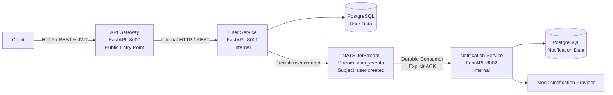
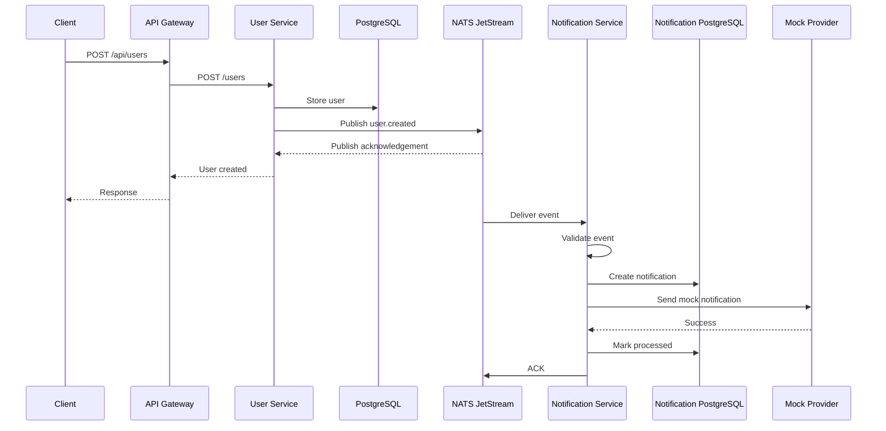

# Event-Driven User Notification Platform

A secure and reliable microservices-based system built with **FastAPI, PostgreSQL, NATS JetStream, JWT, Docker, Docker Compose, and pytest**.

The platform demonstrates asynchronous, event-driven communication between a **User Service** and a **Notification Service** without using REST APIs or WebSockets between them.

---

## Architecture



### Core communication model

```text
Client
  |
  v
API Gateway
  |
  | Internal HTTP
  v
User Service
  |
  | NATS JetStream
  | user.created
  v
Notification Service
```

**Important:** User Service and Notification Service do **not** communicate through REST APIs or WebSockets. Their application-level communication is asynchronous through NATS JetStream.

---

## Project Overview

This project implements the following three application components:

### 1. API Gateway

The API Gateway is the single public HTTP entry point.

Responsibilities:

- Accept client requests.
- Route requests to the User Service.
- Enforce JWT authentication on protected endpoints.
- Prevent clients from directly accessing internal backend services.

### 2. User Service

The User Service owns user-related data and authentication.

Responsibilities:

- User registration.
- User login.
- JWT generation.
- User retrieval.
- Password authentication.
- Publishing the `user.created` event.

### 3. Notification Service

The Notification Service consumes user creation events asynchronously.

Responsibilities:

- Consume `user.created` events.
- Validate event payloads.
- Create notification records.
- Invoke the mock notification provider.
- Track notification processing status.
- Handle duplicate events using `event_id`.
- Explicitly acknowledge successfully processed messages.

---

# Event-Driven Flow

When a new user registers:



The notification operation is therefore decoupled from the synchronous registration response.

---

# Reliability Design

NATS JetStream is used instead of basic fire-and-forget messaging.

The implementation includes:

- Durable JetStream stream.
- Durable consumer.
- Explicit acknowledgements.
- Configured acknowledgement wait period.
- Message redelivery when a message is not acknowledged.
- Persistent notification records.
- Event ID based duplicate handling.
- Notification Service restart recovery.

### Consumer configuration

```text
Stream:
    user_events

Subject:
    user.created

Consumer:
    notification-service

Ack Policy:
    Explicit

Delivery Policy:
    All

Ack Wait:
    30 seconds

Max Deliver:
    Unlimited
```

### Message processing

```text
Receive Message
      |
      v
Validate Event
      |
      +---- Invalid ----> ACK / Ignore
      |
      v
Check event_id
      |
      +---- Already processed ----> ACK / Skip
      |
      v
Create notification
      |
      v
Call mock provider
      |
      +---- Failure ----> Persist failed state
      |                    Leave unacknowledged
      |                    Allow redelivery
      |
      v
Mark processed
      |
      v
ACK
```

---

# Idempotency

Every `user.created` event contains a unique `event_id`.

The Notification Service stores this ID as a unique field in the notification table.

This provides duplicate-event protection:

```text
event_id
   |
   +--> First delivery
   |       |
   |       +--> Process notification
   |
   +--> Duplicate delivery
           |
           +--> Detect existing event
           +--> Skip duplicate
           +--> ACK
```

---

# Security

## JWT Authentication

JWT authentication is enforced at the API Gateway for protected user endpoints.

Verified behavior:

| Request | Result |
|---|---|
| Valid JWT | `200 OK` |
| Invalid JWT | `401 Unauthorized` |
| Missing JWT | `401 Unauthorized` |

## NATS Authentication

NATS credentials are supplied through environment variables.

## Configuration and Secrets

Environment variables are used for:

- Database connection strings.
- NATS connection settings.
- NATS credentials.
- Service configuration.
- JWT configuration.

Real secrets should not be committed to Git.

## Service Isolation

The API Gateway is the public application entry point.

The local Docker Compose setup exposes:

```text
API Gateway       :8000
```

User Service and Notification Service use internal container ports:

```text
User Service          :8001
Notification Service  :8002
```

They are not host-published on those ports.

---

# Technology Stack

| Component | Technology |
|---|---|
| Language | Python |
| API Framework | FastAPI |
| Database | PostgreSQL |
| ORM | SQLAlchemy |
| Message Broker | NATS |
| Durable Messaging | NATS JetStream |
| Authentication | JWT |
| Validation | Pydantic |
| Containerization | Docker |
| Orchestration | Docker Compose |
| Testing | pytest |
| Notification Provider | Mock / Console Provider |

---

# API

The API Gateway provides the public client-facing endpoints.

## Register User

```http
POST /api/users
Content-Type: application/json
```

Example:

```json
{
  "full_name": "Example User",
  "email": "example@example.com",
  "password": "TestPassword123"
}
```

Example response:

```json
{
  "id": 1,
  "email": "example@example.com",
  "full_name": "Example User",
  "is_active": true
}
```

---

## Login

```http
POST /api/users/login
Content-Type: application/json
```

Example:

```json
{
  "email": "example@example.com",
  "password": "TestPassword123"
}
```

Response:

```json
{
  "access_token": "<JWT>",
  "token_type": "bearer"
}
```

---

## Get Current User

```http
GET /api/users/me
Authorization: Bearer <JWT>
```

---

## Get User by ID

```http
GET /api/users/{user_id}
Authorization: Bearer <JWT>
```

Example:

```bash
curl http://localhost:8000/api/users/1 \
  -H "Authorization: Bearer <JWT>"
```

---

# Event Contract

## `user.created`

NATS subject:

```text
user.created
```

Example:

```json
{
  "event_id": "982ef354-3b67-4b3f-82ee-9a6e84d57125",
  "event_type": "user.created",
  "user_id": 19,
  "email": "user@example.com",
  "created_at": "2026-09-10T09:32:19.032703"
}
```

| Field | Type | Description |
|---|---|---|
| `event_id` | UUID | Unique event identifier |
| `event_type` | string | Event type |
| `user_id` | integer | Created user ID |
| `email` | string | User email |
| `created_at` | datetime | User creation timestamp |

The Notification Service validates the event before processing it.

---

# Database Design

## User Service

The User Service owns user data.

Conceptually:

```text
users
├── id
├── email
├── full_name
├── password_hash
├── is_active
└── timestamps
```

## Notification Service

The Notification Service owns notification data.

```text
notifications
├── id
├── event_id        UNIQUE
├── user_id
├── email
├── status
├── error_message
├── created_at
└── processed_at
```

`event_id` is unique to support idempotent event processing.

---

# Project Structure

```text
Event-Driven-User-Notification-Platform/
│
├── .env.example
├── .gitignore
├── docker-compose.yml
├── README.md
│
├── docs/
│   ├── architecture.md
│   ├── architecture.mmd
│   └── api.md
│
├── apps/
│   ├── api-gateway/
│   │   ├── app/
│   │   │   ├── api/
│   │   │   ├── auth/
│   │   │   ├── core/
│   │   │   └── schemas/
│   │   ├── Dockerfile
│   │   └── requirements.txt
│   │
│   ├── user-service/
│   │   ├── app/
│   │   │   ├── api/
│   │   │   ├── core/
│   │   │   ├── db/
│   │   │   ├── models/
│   │   │   ├── repositories/
│   │   │   ├── schemas/
│   │   │   └── services/
│   │   ├── Dockerfile
│   │   └── requirements.txt
│   │
│   └── notification-service/
│       ├── app/
│       │   ├── core/
│       │   ├── db/
│       │   ├── models/
│       │   ├── providers/
│       │   ├── repositories/
│       │   └── schemas/
│       ├── Dockerfile
│       └── requirements.txt
│
├── postgres/
│   └── initdb/
│
├── shared/
│
└── tests/
    ├── conftest.py
    ├── test_gateway_and_error_paths.py
    ├── test_notification_service.py
    ├── test_phase4_nats.py
    └── test_user_service.py
```

---

# Local Development

## Prerequisites

- Docker
- Docker Compose
- Git

## Configure environment

```bash
cp .env.example .env
```

Review the environment configuration before starting the services.

Do not commit real secrets.

## Start the system

```bash
docker compose up -d --build
```

Check running containers:

```bash
docker compose ps
```

## Stop the system

```bash
docker compose down
```

## View logs

```bash
docker compose logs -f
```

Individual service:

```bash
docker compose logs -f user-service
docker compose logs -f notification-service
docker compose logs -f api-gateway
```

---

# Testing

Run the test suite:

```bash
.venv/bin/pytest -q
```

Final verification result:

```text
7 passed, 1 skipped
```

The test suite covers the implemented service behavior and error paths.

---

# Verified Requirements

The assignment requirements have been implemented and verified as follows:

| Requirement | Status |
|---|---|
| User Service | ✅ Completed |
| Notification Service | ✅ Completed |
| API Gateway | ✅ Completed |
| FastAPI backend services | ✅ Completed |
| PostgreSQL persistence | ✅ Completed |
| NATS messaging | ✅ Completed |
| NATS JetStream | ✅ Completed |
| User → Notification asynchronous communication | ✅ Verified |
| No REST/WebSocket User ↔ Notification communication | ✅ Implemented |
| Durable consumer | ✅ Verified |
| Explicit ACK | ✅ Verified |
| Message redelivery | ✅ Verified |
| Duplicate event handling | ✅ Implemented |
| Notification persistence | ✅ Verified |
| Notification Service restart recovery | ✅ Verified |
| JWT authentication | ✅ Verified |
| Invalid JWT rejection | ✅ Verified |
| Missing JWT rejection | ✅ Verified |
| Environment-based configuration | ✅ Implemented |
| Docker | ✅ Completed |
| Docker Compose | ✅ Completed |
| Validation/error handling | ✅ Implemented |
| Automated tests | ✅ 7 passed, 1 skipped |
| README documentation | ✅ |
| Architecture documentation | ✅ |
| API documentation | ✅ |
| Local run instructions | ✅ |

---

# End-to-End Verification

A final end-to-end test successfully verified:

```text
POST /api/users
      |
      v
API Gateway
      |
      v
User Service
      |
      +----> User PostgreSQL
      |
      +----> NATS JetStream
                  |
                  v
          Notification Service
                  |
                  +----> Notification PostgreSQL
                  |
                  +----> Mock Provider
```

The created notification was persisted with:

```text
status = processed
```

A subsequent restart of the Notification Service was also followed by a successful new registration and notification processing, verifying recovery of the durable consumer.

---

# Error Handling

The system handles the main expected failure cases:

### Authentication

```text
Missing JWT → 401
Invalid JWT → 401
```

### User Service communication

If the Gateway cannot reach the User Service, it returns a service-unavailable response.

### Event validation

Invalid event payloads are rejected by Pydantic validation.

### Notification provider failure

Provider failures are persisted as notification failures and the message remains eligible for broker redelivery when it is not acknowledged.

### Duplicate events

Existing `event_id` values are detected to avoid duplicate notification processing.

---

# Design Decisions

## Why NATS JetStream?

JetStream provides durable message storage, consumer state, acknowledgements, and redelivery semantics required for reliable asynchronous processing.

## Why asynchronous communication?

Notification processing does not need to block user registration. The User Service publishes an event and the Notification Service processes it independently.

## Why an API Gateway?

The Gateway creates a single public API boundary while keeping backend services internal.

## Why PostgreSQL?

PostgreSQL provides reliable persistent relational storage without introducing unnecessary additional infrastructure.

## Why a mock notification provider?

The assignment requires notification processing rather than integration with a real external email/SMS provider. The mock provider demonstrates the notification-provider boundary without external dependencies.

---

# Scope

The implementation intentionally focuses on the assignment requirements.

Not included:

- Redis
- Kafka
- RabbitMQ
- Kubernetes
- Frontend
- External email/SMS provider
- Password reset
- OAuth/external identity provider
- Advanced RBAC
- Complex observability stack
- Additional microservices
- WebSockets for service communication

---

# Production Considerations

This project is designed as a production-oriented local microservices implementation.

A production deployment would additionally require infrastructure-level controls such as:

- TLS for service and broker traffic.
- Secure secret management.
- Restricted network policies.
- Database migrations and backups.
- Centralized structured logging.
- Metrics and distributed tracing.
- Horizontal scaling.
- Production deployment orchestration.

These concerns are intentionally kept outside the minimal assignment implementation.

---

# Documentation

Additional documentation:

- `docs/architecture.md` — detailed architecture and reliability design.
- `docs/api.md` — API and event documentation.
- `docs/architecture.mmd` — standalone Mermaid architecture diagram.

---

# License

This project was created as a microservices architecture assignment and demonstration project.