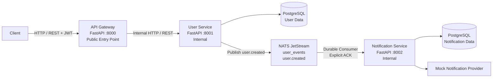
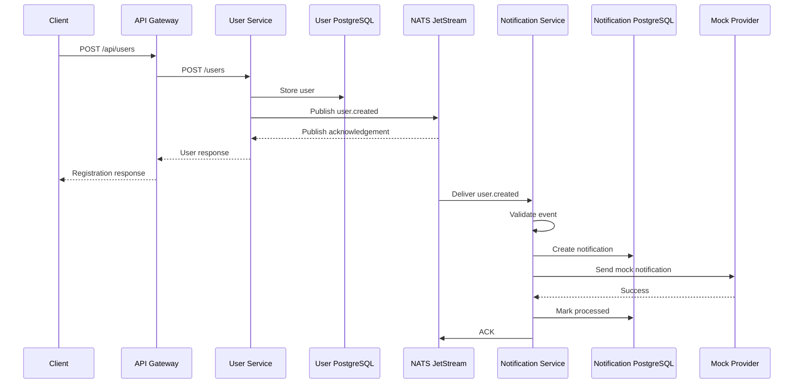

# Architecture Design

## 1. System Overview

The Event-Driven User Notification Platform consists of:

- API Gateway
- User Service
- Notification Service
- PostgreSQL
- NATS JetStream

The API Gateway is the public HTTP entry point. The User Service and Notification Service communicate asynchronously through NATS JetStream.

## 2. Architecture Diagram



## 3. Component Responsibilities

### API Gateway

- Public client-facing API.
- Routes requests to the User Service.
- Enforces JWT authentication on protected endpoints.
- Keeps backend services internal.

### User Service

- Owns user data.
- Handles registration and login.
- Generates JWT access tokens.
- Publishes `user.created` events.

### Notification Service

- Consumes `user.created`.
- Validates events.
- Creates notification records.
- Invokes the mock notification provider.
- Tracks processing status.
- Handles duplicate event IDs.
- Acknowledges successfully processed messages.

### NATS JetStream

- Provides asynchronous communication.
- Persists events.
- Maintains durable consumer state.
- Supports explicit acknowledgements and redelivery.

### PostgreSQL

The application uses persistent relational storage for service-owned data.

## 4. Communication Architecture

The synchronous request path is:

```text
Client
  |
  v
API Gateway
  |
  | Internal HTTP
  v
User Service
```

The asynchronous notification path is:

```text
User Service
      |
      | NATS JetStream
      | user.created
      v
Notification Service
```

There is no REST API or WebSocket communication between User Service and Notification Service.

## 5. Registration Sequence



## 6. Messaging Design

### Stream

```text
Name: user_events
Subject: user.created
```

### Durable Consumer

```text
Name: notification-service
Ack Policy: Explicit
Delivery Policy: All
Ack Wait: 30 seconds
Max Deliver: Unlimited
```

The durable consumer allows Notification Service to resume consuming messages after a restart.

## 7. Event Contract

```json
{
  "event_id": "982ef354-3b67-4b3f-82ee-9a6e84d57125",
  "event_type": "user.created",
  "user_id": 19,
  "email": "user@example.com",
  "created_at": "2026-09-10T09:32:19.032703"
}
```

`event_id` uniquely identifies an event and is used for duplicate-event handling.

## 8. Reliability

The notification pipeline uses:

- Durable JetStream consumer.
- Explicit ACK.
- ACK wait period.
- Broker redelivery for unacknowledged messages.
- Persistent notification state.
- Event ID based idempotency.
- Restart recovery.

Processing model:

```text
Message
  |
  v
Validate
  |
  v
Check event_id
  |
  +--> Already processed --> ACK / Skip
  |
  v
Create notification
  |
  v
Call provider
  |
  +--> Failure --> Persist failed state
  |               Do not ACK
  |               Allow redelivery
  |
  v
Mark processed
  |
  v
ACK
```

## 9. Idempotency

The Notification Service stores `event_id` as a unique value.

This prevents duplicate deliveries from creating duplicate processed notification records.

## 10. Security

### Client authentication

JWT authentication is enforced at the API Gateway.

Verified behavior:

```text
Valid JWT       -> 200 OK
Invalid JWT     -> 401 Unauthorized
Missing JWT     -> 401 Unauthorized
```

### NATS authentication

NATS credentials are provided through environment variables.

### Service isolation

The Gateway is the public application entry point. User Service and Notification Service are internal Compose services.

## 11. Failure Handling

### User Service unavailable

The Gateway returns a service-unavailable response when it cannot communicate with User Service.

### Invalid JWT

The Gateway rejects the request with `401 Unauthorized`.

### Invalid event

The Notification Service validates the event using its Pydantic event schema.

### Provider failure

The notification state records failure and the message is not acknowledged, allowing JetStream redelivery.

### Notification Service restart

The durable consumer allows the service to resume processing after restart.

## 12. Data Ownership

| Service | Owned Data |
|---|---|
| User Service | Users and authentication data |
| Notification Service | Notification records |
| NATS JetStream | Event delivery state |

Service boundaries are kept clear so notification processing does not require direct database access to User Service data.

## 13. Production Considerations

For a production deployment, the following would normally be added:

- TLS.
- Secure secret management.
- Network policies.
- Database migrations and backups.
- Structured centralized logging.
- Metrics and tracing.
- Horizontal scaling.
- Production orchestration.

These are intentionally outside the minimal assignment scope.
